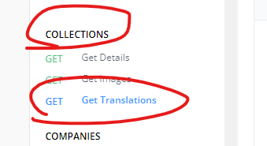

<h3 align="right">
<a href="https://github.com/wrapTMDB/wrapTMDB-ts">Github page</a> |
<a href="https://www.npmjs.com/package/wraptmdb-ts">npm page</a>  
</h3>


# WrapTMDB-ts  
<h3>
<p align="center">
<a href="/docs/README.md"> English </a>|
<a href="/docs/README_ja.md"> 日本語 </a>|
<a href="/docs/README_zh-tw.md"> 繁體中文 </a>|
<a href="/docs/README_zh-ch.md"> 简体中文 </a>
</p>
</h3>
<br/>

# [wrapTMDB](https://github.com/wrapTMDB/wrapTMDB)とは何ですか ?

```wrapTMDB``` は,TMDB APIをラップし,ドキュメントから,さまざまなプログラム言語で実装するのラッパーコレクションです。

開発者が情報やメタデータについて映画やテレビ番組をリクエストするのに役立ちます。<br/>

Typescriptに作て, npmで公開されるリポジトリです,<br/>
続きを [見る](https://github.com/wrapTMDB/wrapTMDB).
___
## どのようなプロジェクトがこのツールを使用しますか ?

- 新しい映画情報を追跡するクライアントを作成したい場合。
- ムービーファイルやビデオの管理に役立つツールを作成したい場合。.
- TMDB公式サイトに取り替えたい場合でも。 (( www
- ...

___
## Useage

### Install:

```bash
$npm install wraptmdb-ts@latest
```

このツールを使用する前に, [api_key](https://developers.themoviedb.org/3/getting-started/authentication) がすでにあることを確認してください.
<br/>

``` Typescript
import * as wrapTMDB from './wrapTMDB'; // import as a namespace

wrapTMDB.Init('YOUR api_key');        //最初にTOKEN_keyを設定する。 
wrapTMDB.SetHeader({                  //ヘッダーの設定（オプションですが推奨）
    'User-Agent': 'npm package-dev',
    Referer: 'wraptmdb-ts',
  });

async function main() {
  let data = {};
  try {
    //using as a promise function
    data = await wrapTMDB.Movie.GetDetails(624860); 
  } catch (err) {
    console.error(err);
  }
  console.log(JSON.stringify(data));
}
main();
```
___

## これらのAPIをどのように認識しますか ?

### 直感を使う:

```Typescript
data = await wrapTMDB.Movies.GetDetails(624860);
```


```Typescript
data = await wrapTMDB.Collections.GetTranslations(654321, 'en-US');
```


```Typescript
data = await wrapTMDB.TVseasons.GetImages(54321, 65421, 'en-US');
```


# 開発に参加する ?
```bash
$git clone https://github.com/wrapTMDB/wrapTMDB-ts &&

npm install ||

touch src/index.ts 
```

___
## その他

*** 星を残して, このツールがあなたに大きな助けになることを願っています. ***

ありがとうございます :)

どんなリクエストでも大歓迎です。