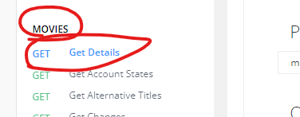
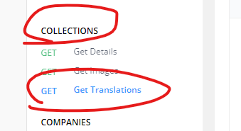
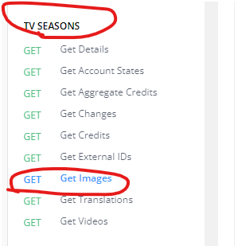

<h3 align="right">
<a href="https://github.com/wrapTMDB/wrapTMDB-ts">Github page</a> |
<a href="https://www.npmjs.com/package/wraptmdb-ts">npm page</a>  
</h3>


# WrapTMDB-ts  
<h3>
<p align="center">
<a href="README.md"> English </a>|
<a href="/docs/README_ja.md"> 日本語 </a>|
<a href="/docs/README_zh-tw.md"> 繁體中文 </a>|
<a href="/docs/README_zh-ch.md"> 简体中文 </a>
</p>
</h3>
<br/>

# [wrapTMDB](https://github.com/wrapTMDB/wrapTMDB) 是什么?

```wrapTMDB``` 是一个包装器集合，并且从TMDB的文档中包装  API 以不同的程序语言实现。
它可以帮助开发者向TMDB请求电影或电视节目的信息和元数据。<br/>

这个库由 Typescript 编写并在 npm 中发布,<br/>
查看[更多](https://github.com/wrapTMDB/wrapTMDB).
___
## 什么样的项目适合使用？

- 如果您想制作一个客户端能够追踪新电影信息。
- 如果您想制作一个工具来帮助您管理电影文件或视频。
- 甚至你想制作一个程序取代TMDB的官方网站。 ((笑
- ...

___
## 使用方式

### Install:

```bash
$npm install wraptmdb-ts@latest
```

在使用此工具之前，请确保您已经拥有 [api_key](https://developers.themoviedb.org/3/getting-started/authentication).
<br/>

``` Typescript
import * as wrapTMDB from 'wraptmdb-ts'; // 作为命名空间导入

wrapTMDB.Init('YOUR api_key');        //开始前先初始化你的TOKEN_key。
wrapTMDB.SetHeader({                  //设置标头（可选但推荐）
    'User-Agent': 'npm package-dev',
    Referer: 'wraptmdb-ts',
  });

async function main() {
  let data = {};
  try {
    //using as a promise function
    data = await wrapTMDB.Movies.GetDetails(624860); 
  } catch (err) {
    console.error(err);
  }
  console.log(JSON.stringify(data));
}
main();
```
___

## 我该如何识别这些 API ?

### 运用你的直觉:

```Typescript
data = await wrapTMDB.Movies.GetDetails(624860);
```


```Typescript
data = await wrapTMDB.Collections.GetTranslations(654321, 'en-US');
```


```Typescript
data = await wrapTMDB.TVseasons.GetImages(54321, 65421, 'en-US');
```



# 加入开发 ?
```bash
$git clone https://github.com/wrapTMDB/wrapTMDB-ts &&

npm install ||

touch src/index.ts 
```

___
## 其他

*** 留个星星吧，希望这个工具能给你很大的帮助。 ***

THANK YOU :)

欢迎任何要求。